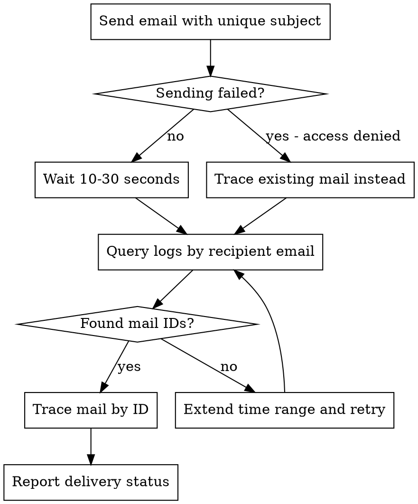

# Send Mail and Trace

Send test emails through the mail infrastructure and trace their complete delivery path.

## Prerequisites

- mailtrace MCP server running with valid config
- **Network access**: Client IP must be authorized by mail server relay policy, OR valid SMTP credentials in `data-generator/.env`

## Workflow



## Step 1: Send Test Email

Use the wrapper script in this skill directory:

```bash
/home/efficacy38/.claude/skills/send-mail/scripts/send-mail \
    --config config.yaml \
    --ssl-mode starttls \
    --no-ssl-verify \
    --rate 1 \
    --duration 1 \
    --mail-subject "Test $(date +%Y-%m-%d_%H:%M:%S) - Mailtrace Verification" \
    --export-records /tmp/sent_emails.json
```

The wrapper script automatically:
- Changes to the data-generator directory
- Loads credentials from `.env`
- Runs the traffic generator via `uvx`

### SSL Mode Options

| Mode | Port | Description | Command |
|------|------|-------------|---------|
| `none` | 25 | No encryption (plain SMTP) | `--ssl-mode none` |
| `starttls` | 587/25 | Upgrade to TLS after connecting | `--ssl-mode starttls` |
| `smtps` | 465 | SSL/TLS from connection start | `--ssl-mode smtps --server-port 465` |

### Common Flags

| Flag | Purpose |
|------|---------|
| `--ssl-mode <mode>` | SSL/TLS mode (`none`, `starttls`, `smtps`) |
| `--no-ssl-verify` | Skip SSL certificate verification (for self-signed certs) |
| `--rate 1 --duration 1` | Send single email |
| `--mail-subject` | Include timestamp for traceability |
| `--export-records` | Save email metadata (message-id, queue-id) for tracing |
| `--no-auth` | Disable authentication |
| `--server-host <host>` | Override SMTP server from config |
| `--server-port <port>` | Override SMTP port |

**Exported records format** (`/tmp/sent_emails.json`):
```json
[
  {
    "timestamp": "2026-01-27T15:00:00.123456+00:00",
    "message_id": "<uuid@traffic-generator.local>",
    "queue_id": "ABC123DEF",
    "subject": "Test 2026-01-27_15:00:00 - Mailtrace Verification",
    "from": "sender@example.com",
    "to": "recipient@example.com",
    "success": true,
    "status_code": 250
  }
]
```

Use `queue_id` from this file to directly trace with `mailtrace_trace_mail`.

## Step 2: Wait for Delivery

```bash
sleep 15
```

Mail typically takes 5-30 seconds to traverse relay chain.

## Step 3: Query Logs

Use mailtrace MCP tool with **email address or domain** (not status phrases):

```
mailtrace_query_logs(
    host="csmail1.test.cc.cs.nctu.edu.tw",
    keywords=["recipient@domain.com"],
    time="2026-01-27 15:00:00",  # current time, server timezone (+08:00)
    time_range="1h"
)
```

**Valid keywords:** Email addresses (`user@example.com`), domains (`example.com`)

**Invalid keywords:** Status phrases like `status=sent` won't match - these are log field values, not searchable text.

## Step 4: Trace Mail

Use returned mail_id to trace complete path:

```
mailtrace_trace_mail(
    host="csmail1.test.cc.cs.nctu.edu.tw",
    mail_id="ABC123DEF",
    time="2026-01-27 15:00:00",
    time_range="1h"
)
```

## Step 5: Verify Delivery

Check trace results for:
- `status=sent` with `dsn=2.0.0` = successful delivery
- `status=deferred` = temporary failure, will retry
- `status=bounced` = permanent failure

## Quick Reference

| Task | Command/Tool |
|------|-------------|
| Send email (STARTTLS) | `send-mail --config config.yaml --ssl-mode starttls --no-ssl-verify --rate 1 --duration 1` |
| Send to different host | `send-mail --config config.yaml --server-host <hostname> ...` |
| Query logs | `mailtrace_query_logs` with recipient email |
| Trace path | `mailtrace_trace_mail` with mail_id |
| Check config | `data-generator/config.yaml` for SMTP settings |
| Credentials | `data-generator/.env` (username/password) |

## Troubleshooting

| Error | Solution |
|-------|----------|
| `530 5.7.0 Must issue STARTTLS` | Use `--ssl-mode starttls` |
| `SSL: WRONG_VERSION_NUMBER` | Port/mode mismatch: use `starttls` for port 25/587, `smtps` for port 465 |
| `SSL: CERTIFICATE_VERIFY_FAILED` | Add `--no-ssl-verify` for self-signed certificates |
| `554 5.7.1 Client host rejected` | Check `.env` credentials or network access |
| `554 no valid recipients` | Server requires auth - ensure `.env` has credentials |
| `535 Authentication failed` | Check credentials in `.env` or use `--no-auth` to skip auth |
| No mail IDs found | Extend `time_range` to `2h` or check keyword spelling |
| Empty trace graph | Mail delivered locally without relay hops |

## Mail Server Clusters

- `smtp-cluster`: csmail1, csmail2 (outgoing relay) - start here for sent mail
- `mx-cluster`: csmx1, csmx2 (incoming mail)
- `mailer-cluster`: mailer4 (application mail)
- `maillist-cluster`: maillist1, maillist2 (mailing lists)
